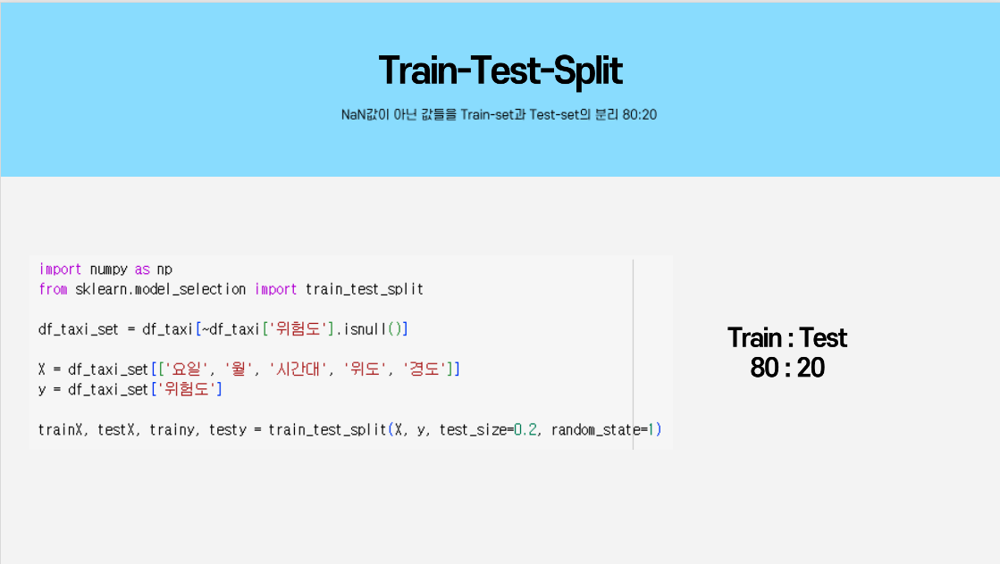

# Proejct_BigDataAnalysis_AccidentRateRelatively
### 2023 빅데이터분석 프로젝트
2023/03/12 ~ 2023/06/20  
기준집단 대비 대상집단을 고려한 교통 사고다발구역의 시공간적 분석 프로젝트

---
## 팀원
- 201810776 소재휘
- 202010848 김성민
- 201810792 이민호
- 201810818 최종원

## 소스 코드
1. 데이터 수집 및 전처리 
   - 부속2) 택시데이터병합전처리.ipynb
   - 전처리 데이터
2. 데이터 분석 및 시각화
   - 사고위험지역분석_프로젝트.ipynb
   - 부속1) 위험도보정계수도출_운행속도대비운행량분석.ipynb

---

# 목차

1. [문제 인식](#문제-인식)
2. [프로젝트 목표](#프로젝트-목표)
3. [데이터 수집](#데이터-수집)
4. [데이터 확인](#데이터-확인)
5. [데이터 분석](#데이터-분석)
   - [데이터 전처리](#데이터-전처리)
   - [모델 적용](#모델-적용)
   - [데이터 정규화](#데이터-정규화)
6. [시각화](#시각화)
7. [기대효과](#기대효과)
---
   
   
   
# 문제 인식

# 프로젝트 목표

# 데이터 수집

# 데이터 확인

# 데이터 분석

## 데이터 전처리

## 모델 적용

## 데이터 정규화

# 시각화

# 기대효과

